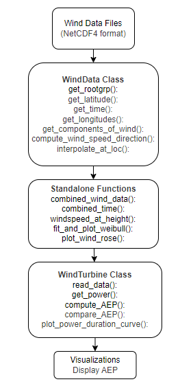

# Our Great Package 
Team: Windcoderss 
This Python package is designed to support wind resource assessment at a specified site using ERA5 reanalysis data. It enables users to process and analyze multi-year hourly wind data at different heights (e.g., 10 m and 100 m) to estimate key wind energy metrics such as wind speed distributions, wind roses, and annual energy production (AEP) for selected turbines.

## Overview
The structure of our final project are as follows: 
FINAL-PROJECT-WINDCODERSS 
├── inputs/ 
│   ├── 1997-1999.nc 
│   ├── 2000-2002.nc 
│   ├── 2003-2005.nc 
│   ├── 2006-2008.nc 
│   ├── NREL_Reference_5MW_126.csv 
│   └── NREL_Reference_15MW_126.csv  
├── outputs/ 
├── src/final_project 
│   └── __init__.py 
├── tests/ 
│   └── Tests.py 
├── examples/ 
│   └── main.py 
├── .gitignore 
├── diagram.png 
├── LICENSE 
├── pyproject.toml 
└── README.md 

## Quick-start guide
Before installing the following packages are required: 
* NetCDF4
* numpy
* matplotlib
* scipy
* windrose

Installation guide: 
In order to install the package do the following: 
1. Go to anaconda prompt.
2. Change directory to the package folder FINAL-PROJECT-WINDCODERSS.
3. Run: "pip install -e ."

This will install the package final_project

## Architecture

This package is designed to analyze and visualize wind turbine performance metrics, including power output, wind characteristiscs, and energy production over time using various statistical and plotting tools. 
The package consist of two main classes and a few standalone helper functions.
1. `WindData` Class 
    This class handles interactions with the NetCDF wind data files, including:
    * Opening datasets
    * Extracting latitude, longitude and time
    * Retrieveing wind component (`u`, `v`)
    * Calculating wind speed and direction
    * Bilinear interpolation for custom locations

2. `WindTurbine` Class  
    Handles wind turbine power data, including:
    * Reading turbine performance curves from .csv file
    * Interpolating power output for any wind speed
    * Computing AEP for selected year (Annual Energy Production)
    * Plotting power duration curve for selected year (Extra functions)
    * Compairing AEP over years (Extra functions)

3. Standalone functions:  
    * `combine_wind_data`: Aggregates speed and directions across multiple NetCDF files
    * `combine_time`: Aggregates time across NetCDF files
    * `windspeed_at_height`: Adjust wind speed using the power law
    * `fit_and_plot_weibull`: Fits a Weibull distribution for wind analysis for the selected year
    * `plot_wind_rose`: Plots the wind rose based on all the provided wind data

Diagram of the package:  
    

## Peer review

This package have been developed working together and taking turns writing the code.  
The different tasks was meade in branches and when they were completed they were merged into main.  
The different functionalities have been developed one at a time and was tested during the development.  
The main.py script which shows the functionalites was finished in the end by both team members.
